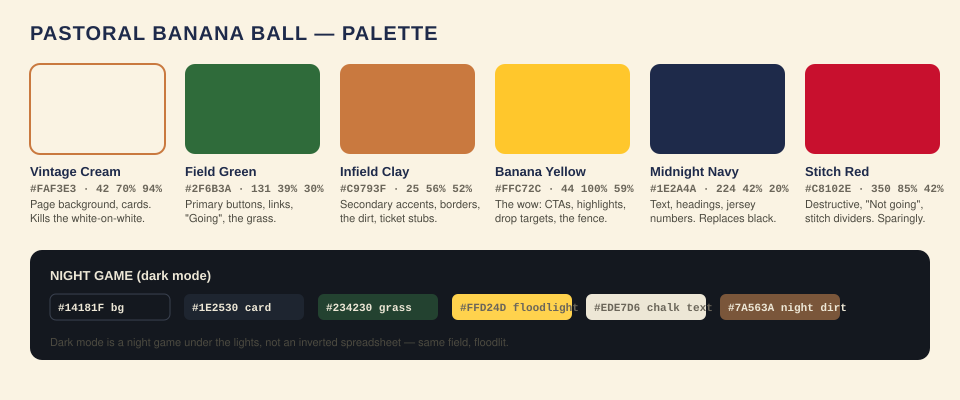
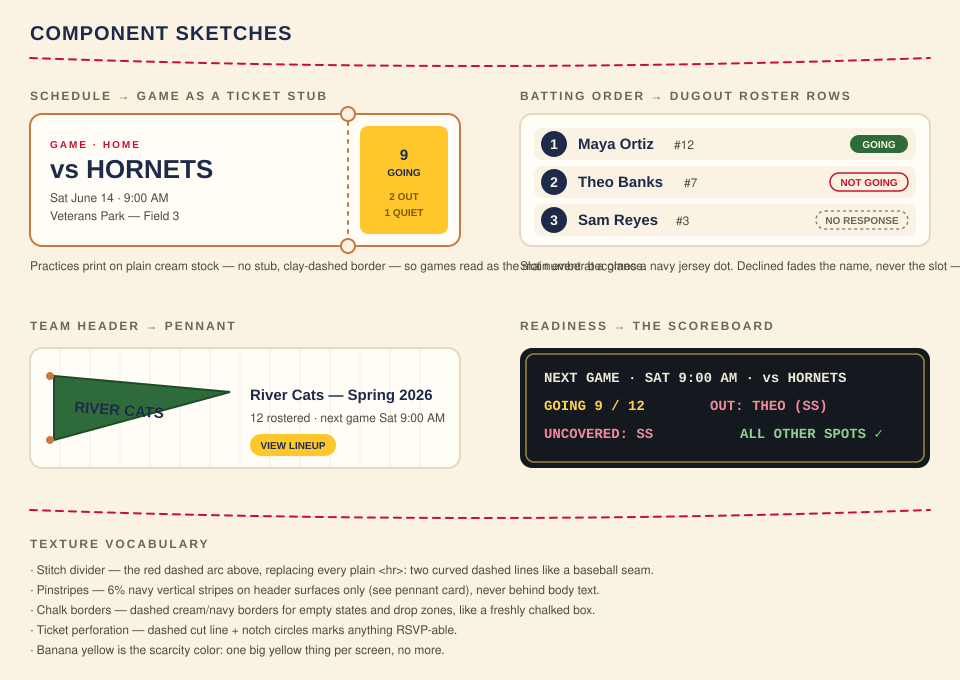
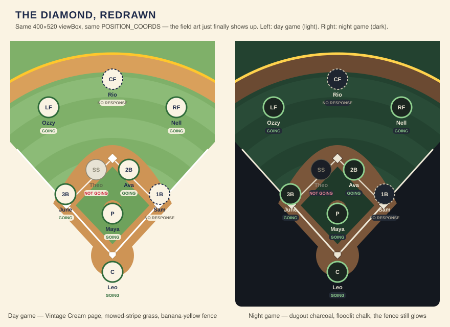

# Pastoral Banana Ball — the design plan

> Old-school pastoral baseball — cream scorecards, chalk lines, mowed grass, felt pennants —
> crashed into by Savannah-Bananas-grade showmanship: one loud banana yellow, chunky slab
> type, tickets, scoreboards, and a little confetti when the coach ships a lineup.

This is the visual overhaul plan for the Youth Baseball Team Manager. It is a **plan, not a
diff** — nothing in `src/` changes until phases start landing — but every spec here was
written against the real code (`globals.css`, `diamond-geometry.ts`, the two chart editors,
the view page) so each phase can be picked up and built without re-deriving anything.

---

## 1. Where we are (the honest audit)

The app is structurally excellent and visually mute:

- **Everything is white, off-white, and near-black.** `--background` is pure white,
  `--primary` is a nearly-black brown (`24 100% 10%`), and the four `--baseball-*` tokens
  (green, brown, blue, red) that were clearly meant to carry the theme are defined in
  `globals.css` but almost nowhere used. The theme exists as unpaid potential.
- **The diamond is a hollow polygon.** `DIAMOND_POLYGON` draws four `stroke-border` lines
  on a blank card. No grass, no dirt, no bases, no foul lines. A parent squinting at a
  phone at the field sees a kite, not a ballfield.
- **Every surface is the same surface.** Games, practices, rosters, settings — identical
  white cards with identical gray borders. Nothing signals "this is the fun page" (the
  lineup) vs. "this is the admin page" (settings).
- **Typography is one voice.** Geist everywhere, at polite sizes. Nothing shouts
  "GAME DAY."

What's already *right* and must not be lost: the RSVP visual vocabulary is centralized
(`rsvp-style.ts`), state is never color-alone, the diamond geometry is shared between
viewer and editor, and the dnd-kit/Motion separation is documented and respected. The
redesign works **through** those systems, not around them.

## 2. Design principles

1. **Day at the ballpark, not a SaaS dashboard.** Warm cream paper, real green, real clay.
   The default screen temperature goes from "hospital" to "July."
2. **One banana per screen.** Banana Yellow is the wow — and it only wows if it's scarce.
   Exactly one big yellow element per screen (the CTA, the fence, the drop highlight).
   Two bananas is a fruit stand.
3. **Crunchy = texture + chunk + snap.** Grain of paper (subtle pinstripes, chalk-dash
   borders, stitch dividers), chunky slab display type, and snappy micro-motion. Never
   gradients-and-glassmorphism modern; this is felt-and-cardstock modern.
4. **Sunlight-first.** This app is read outdoors on a phone at 9 AM. Every color pairing
   in this plan clears WCAG AA at its size; state always keeps its text label. Fun that
   hurts legibility loses.
5. **The data model is the personality.** The standing chart, the three RSVP states, the
   "declined fades but never leaves" rule — the design amplifies existing semantics and
   invents zero new ones.

## 3. Color system

The full palette with hex/HSL and usage is in the image above. Token changes land in
`globals.css` (Tailwind 4 `@theme inline` picks them up automatically — no config file):

| Token | Light ("day game") | Dark ("night game") | Notes |
|---|---|---|---|
| `--background` | `42 70% 94%` Vintage Cream | `218 22% 10%` Dugout Charcoal | The single biggest de-black-and-whitening move |
| `--foreground` | `224 42% 20%` Midnight Navy | `45 36% 88%` Chalk | Navy replaces near-black everywhere |
| `--primary` | `131 39% 30%` Field Green | `120 41% 69%` night grass-glow | Buttons/links become *green*, not black |
| `--secondary` | `25 56% 52%` Infield Clay at 15% | clay-dark surface | Warm secondary surfaces |
| `--accent` | `44 100% 59%` Banana Yellow | `45 100% 65%` Floodlight | New meaning: the one-per-screen wow |
| `--destructive` | `350 85% 42%` Stitch Red | lightened stitch | Also the seam-divider color |
| `--card` | `45 60% 98%` warm white | `220 19% 15%` | Cards stay lighter than the page → depth for free |
| `--border` | `35 30% 82%` warm sand | `219 14% 24%` | Borders get warm, stop disappearing |
| `--baseball-*` | retire or re-point at the above | — | One palette, not two competing ones |

Dark mode is a **night game**: same field under floodlights — charcoal sky, deeper grass,
glowing chalk, and the yellow gets *brighter*, not muted. It already keys off
`prefers-color-scheme`; only the values change.

Contrast spot-checks (must re-verify in review): navy on cream 11.9:1 ✓ · Field Green on
cream 5.6:1 ✓ · navy on Banana Yellow 7.5:1 ✓ · white on Field Green 5.9:1 ✓. Banana
Yellow never carries white text, ever.

## 4. Typography

| Role | Face | How |
|---|---|---|
| Display / page titles / "GAME DAY" | **Alfa Slab One** (Google) | `next/font/google`, exposed as `--font-display`, new `font-display` utility via `@theme` |
| Body / UI | **Geist** (keep) | Already loaded; it's a good body face |
| Scoreboard numbers, dates, jersey numbers | **Geist Mono** (keep, promote) | Tabular numerals for the readiness scoreboard and ticket stubs |

Rules: Alfa Slab only at 20px+, only for headings and hero numbers, often uppercase with
`tracking-wide`. Body stays Geist — slab body text is a ransom note. (If Alfa Slab feels
too heavy in situ, **Graduate** is the collegiate-athletic fallback; decide once, in
Phase 1, on a real phone.)

## 5. Texture vocabulary

Five reusable motifs — each one a tiny component or utility class, built once in Phase 1
and then spent everywhere (see sketches):

1. **Stitch divider** — `<StitchDivider/>`: two shallow dashed red arcs (SVG), the seam of
   a baseball. Replaces plain `
`/border-t section breaks.
2. **Pinstripes** — a `bg-pinstripe` utility (CSS `repeating-linear-gradient`, 6% navy on
   transparent, 24px period). Header bands and hero surfaces only, never behind body text.
3. **Chalk box** — dashed 2px warm border + slightly-inset fill; the style for every empty
   state and every drop zone. Already half-exists in the editors' dashed borders — this
   names it and warms it up.
4. **Ticket perforation** — vertical dashed rule with punched-notch circles; marks
   anything RSVP-able (game cards, the event page header).
5. **Jersey dot** — navy circle, cream number, Geist Mono. Batting slot numbers, roster
   jersey numbers.

## 6. The diamond finally looks like a diamond ⚾

The centerpiece, and the explicit second half of the brief. Full mockup, day and night:

### What gets drawn (back to front)

All inside the existing `400 × 520` viewBox, behind the existing markers:

1. **Grass wedge** — fills the fair-territory fan from home plate `(200,420)` out along
   both foul lines to the top corners; page-cream shows through in foul ground, keeping
   the poster-illustration feel.
2. **Mow stripes** — concentric rings centered on home (r 90/170/250/330, 40 wide) in a
   slightly lighter green. This is 90% of the "real field" feeling for four circles of
   effort.
3. **Warning track + fence** — a tan arc band at r≈360–395 and a 5px **Banana Yellow
   fence line** at r=395. The fence is that screen's one banana.
4. **Infield dirt** — `M200,444 L316,318 Q200,90 84,318 Z` (a diamond with an arced back
   edge behind second), plus the home-plate circle (r 42 — big enough that the catcher
   marker at y=452 stands on dirt) and mound (r 18 at `(200,330)`).
5. **Infield grass** — the inset diamond `(200,398) (272,322) (200,246) (128,322)`.
   SS/2B markers at y=252 land on the dirt behind it, exactly where they stand in life.
6. **Chalk** — white foul lines home→`(14,213)`/`(386,213)` and the basepath diamond;
   white bases (rotated squares), home plate pentagon, pitching rubber.

### How it lands in code

- **New `FieldArt` server component** (`src/components/FieldArt.tsx`), pure SVG `<g>`,
  rendered by *both* `view/Diamond.tsx` and `PositionsEditor.tsx`'s `Field` before their
  markers/targets — same sharing rule that already governs `diamond-geometry.ts`, and the
  geometry constants for the art live in that same file so viewer and editor can never
  drift.
- **Nothing moves.** `POSITION_COORDS`, the 520 height, marker radius, name/tag offsets
  all stay. The catcher's name at y+47 stays inside the viewBox (the documented clipping
  trap). In the editor the art is inside the existing absolutely-positioned SVG; the HTML
  drop targets and dnd-kit measurement are untouched.
- **Theme-aware** via the CSS tokens (`fill-[hsl(var(--…))]`-style classes), so the night
  game falls out of dark mode for free.
- **Markers restyle, semantics frozen.** Cream-filled circles; `RSVP_STYLE` keeps its
  three entries and label-plus-color rule — attending gets a thick Field Green ring,
  declined fades, no-response stays dashed. New: a small cream **pill behind the
  name/RSVP tag** (a `rx`-rounded `<rect>` under the existing `<text>`), because navy
  text needs backing to stay readable on grass. The `NoCatcherMarker` disc survives
  unchanged on the home-circle dirt.
- **allPlay outfield** markers already arc across exactly this grass
  (`outfieldZoneCoords`); they inherit the pills and need nothing else.

## 7. Screen-by-screen pass

**Sign-in** — first impression, currently a form. Cream page, pinstripe band, slab
wordmark, one banana button ("Email me a magic link"), and a tiny flat field illustration
(a cropped reuse of `FieldArt`). Empty-state copy: "The gate's open."

**Team home + `TeamCard`** — cards become **pennant cards**: small felt-green pennant
glyph, slab team name, warm card stock. Archived teams go sepia ("retired jersey") with a
`RETIRED` tag instead of just being text-muted.

**Schedule** — games become **ticket stubs** (sketch A): perforated edge, slab opponent
name, Geist Mono date, RSVP tallies on the stub end. Practices print on plain cream stock
with a clay dashed border — games must feel like the main event. Month grid keeps using
`calendar.ts` helpers exclusively (the `APP_TIMEZONE` rule).

**Event page** — RSVP buttons get real weight: Going = Field Green fill, Not going =
stitch-red outline, current selection ringed. One moment of delight: RSVPing "Going" pops
a ⚾ micro-animation (Motion, `prefers-reduced-motion`-gated).

**Lineup view (`/view`)** — the payoff page. The full-field diamond above; batting order
as **dugout roster rows** (sketch B): jersey-dot slot number, name, RSVP pill. The
existing `Reveal` staggers rows in like a lineup being announced.

**Chart editors** — restraint zone; dnd-kit owns every dragged element (the AGENTS.md
rule), so flair goes only into *static* styling: field art behind the position targets,
chalk-box drop zones, warmer chips with jersey dots. The drop-target hover state
(`isOver`) becomes a Banana Yellow chalk glow — that screen's one banana. **No Motion
anywhere near a chip.** Save button: "Post the lineup"; success confirmation (after
dnd-kit is done and the action returns) may confetti, once, briefly.

**Readiness** — becomes **The Scoreboard** (sketch D): charcoal panel even in light mode,
floodlight-yellow Geist Mono figures, uncovered positions in red. It's read-only math
(`readiness.ts` stays pure); this is purely a costume change.

**Roster/members/directory/settings** — calm pages: warm tokens, stitch dividers, jersey
dots on roster rows, no bananas. Admin should feel tidy, not loud.

**Empty states everywhere** — chalk box + one line of voice: "Nobody on the roster yet.
Every dynasty starts somewhere." Copy stays informative first, funny second; parents skim.

## 8. Motion (the Savannah swagger, safely)

Via the existing `LazyMotion`/`m` setup only:

- Page-level: 150–200ms fade-up on card mount; stagger lists (lineup, schedule) ~40ms.
- Micro: RSVP pop, save-success tick, pennant hover tilt (±2°).
- Celebration: one confetti burst (green/yellow/cream, ~1.2s) on chart save success only.
- Hard rules: nothing dnd-kit touches gets Motion (documented collision); every
  non-essential animation respects `prefers-reduced-motion`; nothing loops forever.

## 9. Voice

Current copy is fine and stays fine; it gets one seasoning pass. Headlines may play
("Game day," "The gate's open"); data and instructions never do. RSVP labels
Going / Not going / No response are **frozen** — they're shared vocabulary across two
pages and a legend, and clarity outranks comedy on the thing parents check from a car.

## 10. Accessibility & field-readability checklist

- AA contrast for all text; large-text-AA minimum for text-on-illustration (with pill
  backing on the diamond).
- State = color **+ label** always (already policy in `rsvp-style.ts`; extends to tickets
  and the scoreboard).
- The diamond keeps its `aria-hidden` + `sr-only` list pattern; `FieldArt` is decoration
  and adds no announced content.
- Focus rings: 2px Banana Yellow outer ring on navy/green, navy on yellow — visible in
  sunlight.
- Touch targets ≥44px in editors and RSVP buttons (drag activation constraints already
  tuned in `drag-activation.ts` — don't fight them).

## 11. Build phases

Each phase ships independently and `pnpm check` gates each one.

| Phase | What | Where | Size |
|---|---|---|---|
| **1. Repaint** | New tokens light+dark, Alfa Slab via `next/font`, `bg-pinstripe` utility, `StitchDivider`, chalk-box classes, jersey dot | `globals.css`, `layout.tsx`, `src/components/` | S–M |
| **2. The field** | `FieldArt` + geometry constants, wire into `Diamond.tsx` and `PositionsEditor`, marker pills | `diamond-geometry.ts`, `FieldArt.tsx`, both diamonds | M |
| **3. Paper goods** | Ticket-stub game cards, pennant team cards, dugout batting rows, scoreboard readiness | schedule, team home, view, readiness pages | M–L |
| **4. Showtime** | Reveal/stagger polish, RSVP pop, save confetti, empty-state voice pass | scattered, small | S |

Phase 1 alone already answers "horribly black and white." Phases are ordered by
wow-per-effort.

## 12. Guardrails (read before building any phase)

- dnd-kit and Motion never touch the same element. Editors get static flair only.
- `POSITION_LABELS` is the only source of position abbreviations.
- Diamond geometry: check the lowest marker's y+47 against the viewBox before moving
  anything; viewer and editor share every drawn coordinate through `diamond-geometry.ts`.
- `RSVP_STYLE` stays the single RSVP vocabulary; three states, label + color, declined
  fades the name and never the slot.
- No per-game anything sneaks in via design (no "today's lineup" variants — the chart is
  standing; Decision 16).
- Dates through `calendar.ts` helpers only.
- One banana per screen.
